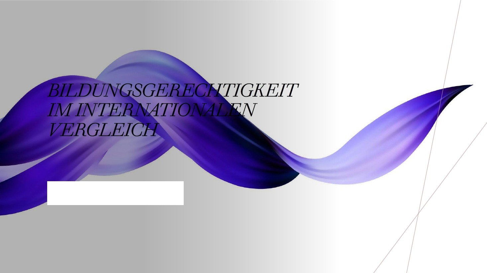
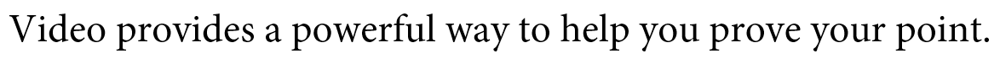
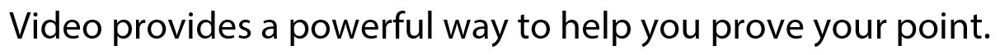

# Concevoir la présentation

Nous avons déjà vu qu'on ne démarre pas la préparation des sa présentation en cliquant sur PowerPoint. Cependant les diaporamas jouent un rôle important pour la présentation. Les diaporamas servent avant tout à souligner ce que vous dites. Elles ne sont ni notes, ni polycopié pour le public. Dans cette partie nous allons voir comment concevoir ces trois éléments essentielles pour la présentation.

Dans certains cas il sera même possible que vous n'avez pas besoin de diapos. Quand vous voulez discuter en détail de certains diagrammes, graphiques ou faits, il est souvent envisageable de fournir seulement le polycopié et de baser son discours sur lui.

## Les diapos

Dans cette section nous allons voir d'après quels principes on peut concevoir sa présentation, afin de souligner de manière efficace son discours.

### La grille de base

### La relation "signal-noise"

### Picture superiority effect

### Contraster, aligner, rapprocher et répéter

Contraster :

#### Que dire sur les points clés ?

### Les éléments du design

#### Répartition de l'espace

#### Typographie

Concevez votre présentation pour les gens assis au fond de la salle : Bigger si better! Pour verifier si votre police de caractères est assez grande vous pouvez imprimer imprimer trois diapos sur une page ([Tutorial \| YouTube](https://www.youtube.com/watch?v=Hgi0_kJ1TAY)). Quand tout est bien lisible, il le sera aussi quand vous délivrez la présentation.

Quelle police de caractères ? On distingue des polices avec serifs ou sans serifs.

Avec la qualité des vidéoprojecteurs d'aujourd'hui il est possible de choisir aussi une police sans serifs pour ses diapos. Pour les textes très longs il convient mieux d'utiliser une police avec serifs. Mais pour des textes plus courts -- le cas d'une diaporama -- des polices sans serifs sont aussi possibles. Ils ont un caractère plus léger et moderne [cf. @bühler2017]

#### Couleurs

Avec les couleurs du diaporama il est possible de s'exprimer voire d'influencer le public d'une certaine manière. Cf. [Color Meanings](https://www.adobe.com/creativecloud/design/discover/color-meaning.html) pour explications plus précises sur significations des couleurs différents. Que faire si on a trouvé sa couleur principale? Comment obtenir une palette des couleurs adéquates? Un conseil: [Adobe Colors](www.colors.adobe.com). Ici vous pouvez à partir des schémas de combinaison des couleurs définir une palette harmonisée. Il est aussi possible de faire créer une palette a partir d'une photo clé qu'on va utiliser dans sa présentation. En plus il y a un tas de palettes déjà faites à découvrir -- donc pas besoin de concevoir une toute nouvelle palette.[^creer-diapos-1]

[^creer-diapos-1]: Pour une explication comment créer une palette de couleurs en PowerPoint, voir cette vidéo: [YouTube](https://youtu.be/gp5yhXABP4I?t=150).

Lumière éteinte ou allumée ? Quand le vidéoprojecteur est assez fort, pourquoi éteindre la lumière ?

> If you want your presentation to be more effective, then don't touch that light switch. Even when you are using slides, the more lights you can keep on, the better off you will be. Remember, you're trying to connect, to tell a story, to sell an idea to the board or other decision makers. It is verydifficult to make a connection if the audience can't see you. The audience is not there to witness the narration of slides; they are there to listen to you and become engaged with you and your topic. If the audience can't see you, they will find it difficult to listen, and they are certa inly more likely to tune you out. The audience must experience both your "verbal speech" and your "visual speech." A relatively small part of your message is actually verba l. The rest of your message is expressed visually and vocally. Influencing people verbally becomes far more difficult when they can't see you [@reynolds2008,208].

### Une foire aux présentations modèles

**Tache:** Créez un design avec une palette des couleurs, décidez vous aussi pour une police de caractères. Ajoutez ensuite une diapo avec la grille de vos diapos et deux diapos exemplaires. Un modèle est mis à votre disposition.[^creer-diapos-2]

[^creer-diapos-2]: Vous trouverez des modèles à remplir ici: [Drive]()

## Vos notes

## Le polycopié

Avant de commencer la section : trois diapos par page A4 ne sont pas un polycopié. PowerPoint ou Keynote ne sont pas d'outils pour créer un text. Il y a des outils beaucoup plus appropriés : LaTeX, Microsoft Word, Microsoft Publisher, LibreOffice Writer, Adobe InDesgin...

Pour créer des formats différents d'un document. Il peut être approprié de travailler en *Markdown*. Il y a des éditeurs diverses qui permettent d'écrire en *Markdown* (voir Tab. \@ref(tab:Editeurs-Markdown)). *Pandoc* permet ensuite d'émettre des documents dans différents formats.

|                         |         |                                                       |
|-----------------|---------------|----------------------------------------|
| RStudio                 | gratuit | possibilité de créer des documents html, pdf, epub... |
| Typora                  | 15\$    | possibilité de créer des documents html, pdf, epub... |
| Microsoft Visual Studio | gratuit | possibilité de créer des documents html, pdf, epub... |

: (#tab:Editeurs-Markdown) Editeurs Markdown

Pour obtenir des textes bien placés, je recommande fortement d'utiliser LaTeX. Si on se connaît bien en conception de documents, Microsoft Publisher, Adobe InDesign ou Scribus (gratuit) peuvent être une très bonne alternative. Microsoft Word est dans presque tous les cas le plus mauvais choix et la création du document prendra plus de temps.

### Conception du polycopié

-   Répartition sur la page : Vous êtes plutôt contraint à utiliser un format A4. Laissez donc des marges assez larges afin de garder une bonne lisibilité. Une bonne règle est de composer des lignes de 50-70 caractères. Une alternative peut être de faire deux colonnes ou opter pour une mise en page asymétrique. [Edward Tufte](https://fr.wikipedia.org/wiki/Edward_Tufte) conçoit ses [polycopiés](https://www.progressiprocity.com/home/make-a-handout-like-edward-tufte-965.htm) par exemple de cette façon.

-   Choisissez une police de caractères sérieuse et bien lisible. Pour plus de règles de typographie voir ce post : [Typography Basics \| Hubspot](https://blog.hubspot.com/marketing/typography-terms-introduction).

-   Sur le polycopié mettez toutes les informations importantes pour comprendre vos propos. Contrairement à votre PowerPoint le polycopié devrait être compréhensible sans avoir entendu votre discours. Selon le type de la présentation ajoutez votre bibliographie.

-   Pour les question à la suite de votre discours, il est envisageable d'ajouter vos coordonnées.

### Une foire aux polycopiés modèles

Tâche: Créez des polycopiés modèles en A4 ! Ils devront être fournis en format PDF. De préférence, licenciez-les sous une licence CC0 ou CC BY ([plus d'informations](https://creativecommons.org/about/cclicenses/)). Téléchargez les modèles sur la plateforme.
